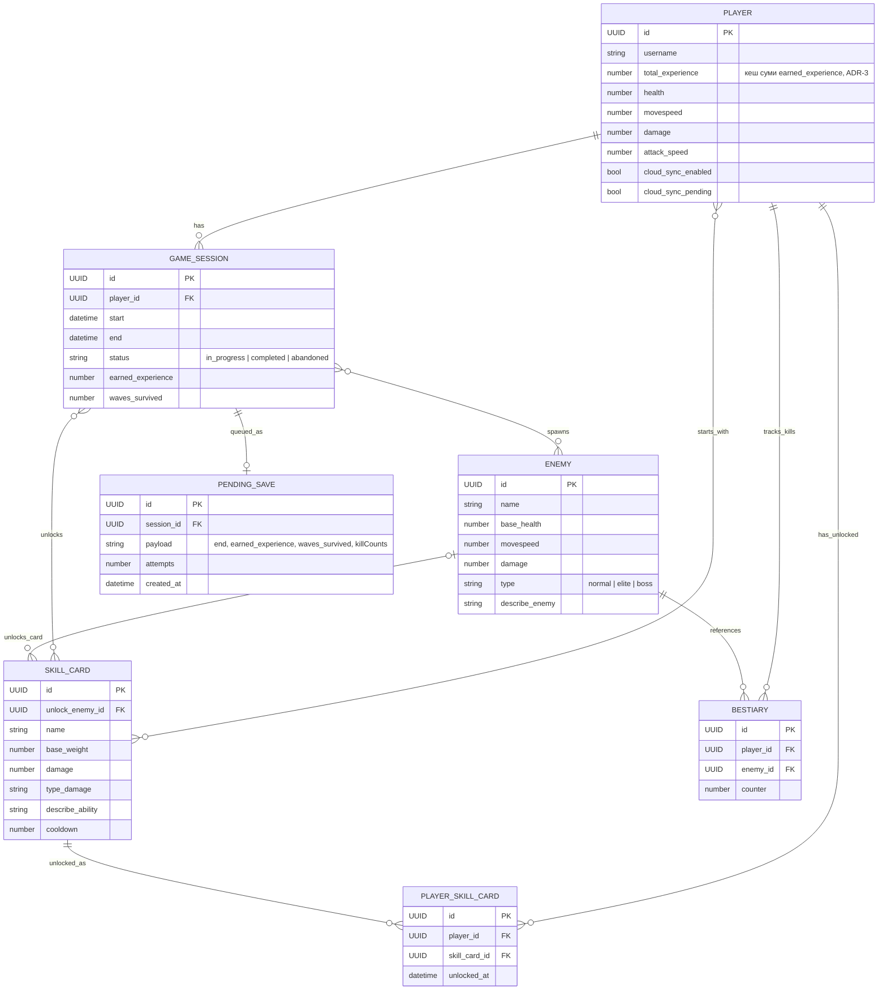

```mermaid
erDiagram
    PLAYER {
        UUID id PK
        string username
        number total_experience "кеш суми earned_experience, ADR-3"
        number health
        number movespeed
        number damage
        number attack_speed
        bool cloud_sync_enabled
        bool cloud_sync_pending
    }
    GAME_SESSION {
        UUID id PK
        UUID player_id FK
        datetime start
        datetime end
        string status "in_progress | completed | abandoned"
        number earned_experience
        number waves_survived
    }
    SKILL_CARD {
        UUID id PK
        UUID unlock_enemy_id FK
        string name
        number base_weight
        number damage
        string type_damage
        string describe_ability
        number cooldown
    }
    ENEMY {
        UUID id PK
        string name
        number base_health
        number movespeed
        number damage
        string type "normal | elite | boss"
        string describe_enemy
    }
    BESTIARY {
        UUID id PK
        UUID player_id FK
        UUID enemy_id FK
        number counter
    }
    PLAYER_SKILL_CARD {
        UUID id PK
        UUID player_id FK
        UUID skill_card_id FK
        datetime unlocked_at
    }
    PENDING_SAVE {
        UUID id PK
        UUID session_id FK
        string payload "end, earned_experience, waves_survived, killCounts"
        number attempts
        datetime created_at
    }
    PLAYER ||--o{ GAME_SESSION : "has"
    PLAYER }o--o{ SKILL_CARD : "starts_with"
    PLAYER ||--o{ PLAYER_SKILL_CARD : "has_unlocked"
    SKILL_CARD ||--o{ PLAYER_SKILL_CARD : "unlocked_as"
    GAME_SESSION }o--o{ SKILL_CARD : "unlocks"
    GAME_SESSION }o--o{ ENEMY : "spawns"
    PLAYER ||--o{ BESTIARY : "tracks_kills"
    ENEMY ||--o{ BESTIARY : "references"
    ENEMY |o--o{ SKILL_CARD : "unlocks_card"
    GAME_SESSION ||--o| PENDING_SAVE : "queued_as"
```
