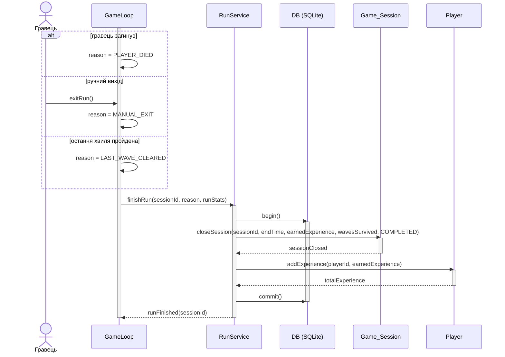

```mermaid
sequenceDiagram
    actor P as Гравець
    participant GL as GameLoop
    participant RS as RunService
    participant DB as DB (SQLite)
    participant S as Game_Session
    participant PL as Player
    activate GL
    alt гравець загинув
        GL->>GL: reason = PLAYER_DIED
    else ручний вихід
        P->>GL: exitRun()
        GL->>GL: reason = MANUAL_EXIT
    else остання хвиля пройдена
        GL->>GL: reason = LAST_WAVE_CLEARED
    end
    GL->>RS: finishRun(sessionId, reason, runStats)
    activate RS
    RS->>DB: begin()
    activate DB
    RS->>S: closeSession(sessionId, endTime, earnedExperience, wavesSurvived, COMPLETED)
    activate S
    S-->>RS: sessionClosed
    deactivate S
    RS->>PL: addExperience(playerId, earnedExperience)
    activate PL
    PL-->>RS: totalExperience
    deactivate PL
    RS->>DB: commit()
    deactivate DB
    RS-->>GL: runFinished(sessionId)
    deactivate RS
    deactivate GL
```
