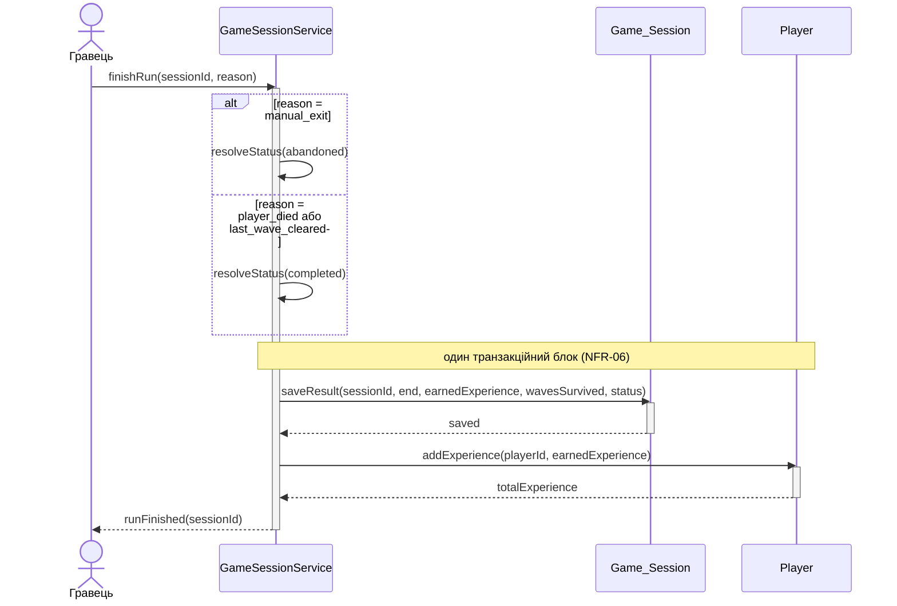

```mermaid
sequenceDiagram
    actor P as Гравець
    participant GS as GameSessionService
    participant S as Game_Session
    participant PL as Player
    P->>GS: finishRun(sessionId, reason)
    activate GS
    alt reason = manual_exit
        GS->>GS: resolveStatus(abandoned)
    else reason = player_died або last_wave_cleared
        GS->>GS: resolveStatus(completed)
    end
    Note over GS,PL: один транзакційний блок (NFR-06)
    GS->>S: saveResult(sessionId, end, earnedExperience, wavesSurvived, status)
    activate S
    S-->>GS: saved
    deactivate S
    GS->>PL: addExperience(playerId, earnedExperience)
    activate PL
    PL-->>GS: totalExperience
    deactivate PL
    GS-->>P: runFinished(sessionId)
    deactivate GS
```
