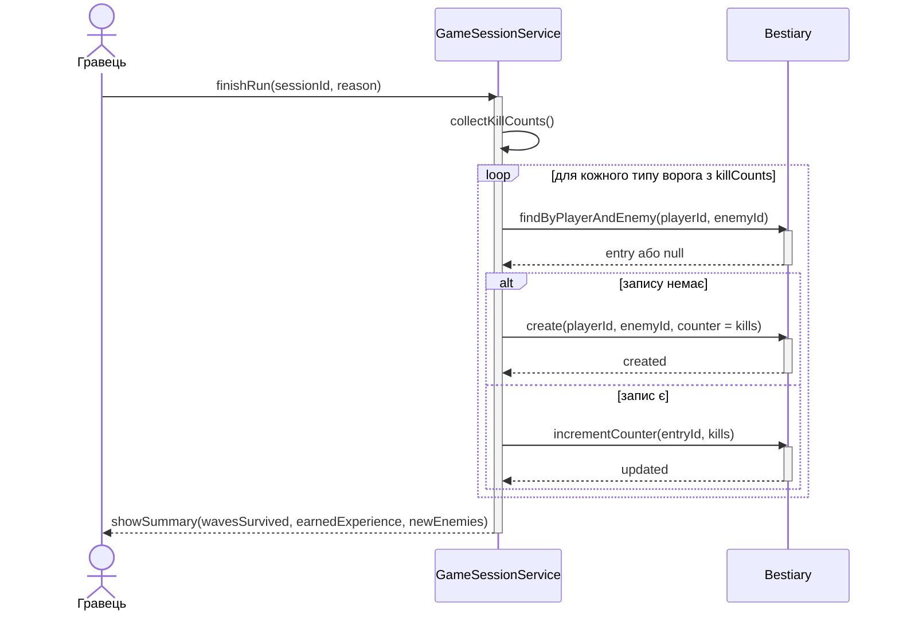

```mermaid
sequenceDiagram
    actor P as Гравець
    participant GS as GameSessionService
    participant B as Bestiary
    P->>GS: finishRun(sessionId, reason)
    activate GS
    GS->>GS: collectKillCounts()
    loop для кожного типу ворога з killCounts
        GS->>B: findByPlayerAndEnemy(playerId, enemyId)
        activate B
        B-->>GS: entry або null
        deactivate B
        alt запису немає
            GS->>B: create(playerId, enemyId, counter = kills)
            activate B
            B-->>GS: created
            deactivate B
        else запис є
            GS->>B: incrementCounter(entryId, kills)
            activate B
            B-->>GS: updated
            deactivate B
        end
    end
    GS-->>P: showSummary(wavesSurvived, earnedExperience, newEnemies)
    deactivate GS
```
 