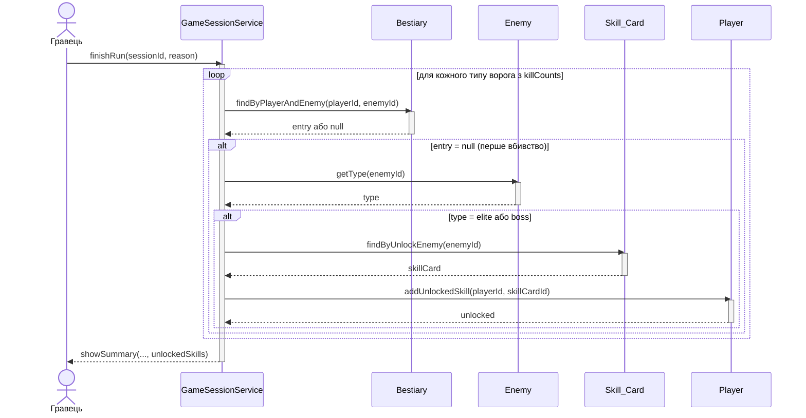

```mermaid
sequenceDiagram
    actor P as Гравець
    participant GS as GameSessionService
    participant B as Bestiary
    participant E as Enemy
    participant SC as Skill_Card
    participant PL as Player
    P->>GS: finishRun(sessionId, reason)
    activate GS
    loop для кожного типу ворога з killCounts
        GS->>B: findByPlayerAndEnemy(playerId, enemyId)
        activate B
        B-->>GS: entry або null
        deactivate B
        alt entry = null (перше вбивство)
            GS->>E: getType(enemyId)
            activate E
            E-->>GS: type
            deactivate E
            alt type = elite або boss
                GS->>SC: findByUnlockEnemy(enemyId)
                activate SC
                SC-->>GS: skillCard
                deactivate SC
                GS->>PL: addUnlockedSkill(playerId, skillCardId)
                activate PL
                PL-->>GS: unlocked
                deactivate PL
            end
        end
    end
    GS-->>P: showSummary(..., unlockedSkills)
    deactivate GS
```
