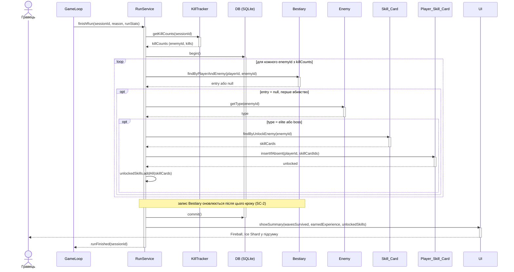

```mermaid
sequenceDiagram
    actor P as Гравець
    participant GL as GameLoop
    participant RS as RunService
    participant KT as KillTracker
    participant DB as DB (SQLite)
    participant B as Bestiary
    participant E as Enemy
    participant SC as Skill_Card
    participant PSC as Player_Skill_Card
    participant UI as UI
    GL->>RS: finishRun(sessionId, reason, runStats)
    activate RS
    RS->>KT: getKillCounts(sessionId)
    activate KT
    KT-->>RS: killCounts (enemyId, kills)
    deactivate KT
    RS->>DB: begin()
    activate DB
    loop для кожного enemyId з killCounts
        RS->>B: findByPlayerAndEnemy(playerId, enemyId)
        activate B
        B-->>RS: entry або null
        deactivate B
        opt entry = null, перше вбивство
            RS->>E: getType(enemyId)
            activate E
            E-->>RS: type
            deactivate E
            opt type = elite або boss
                RS->>SC: findByUnlockEnemy(enemyId)
                activate SC
                SC-->>RS: skillCards
                deactivate SC
                RS->>PSC: insertIfAbsent(playerId, skillCardIds)
                activate PSC
                PSC-->>RS: unlocked
                deactivate PSC
                RS->>RS: unlockedSkills.addAll(skillCards)
            end
        end
    end
    Note over RS,B: запис Bestiary оновлюється після цього кроку (SC-2)
    RS->>DB: commit()
    deactivate DB
    RS->>UI: showSummary(wavesSurvived, earnedExperience, unlockedSkills)
    activate UI
    UI-->>P: Fireball, Ice Shard у підсумку
    deactivate UI
    RS-->>GL: runFinished(sessionId)
    deactivate RS
```
