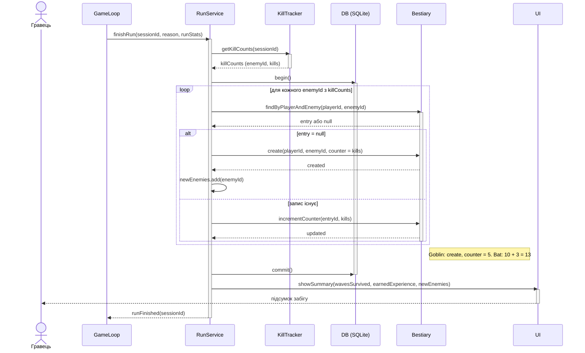

```mermaid
sequenceDiagram
    actor P as Гравець
    participant GL as GameLoop
    participant RS as RunService
    participant KT as KillTracker
    participant DB as DB (SQLite)
    participant B as Bestiary
    participant UI as UI
    GL->>RS: finishRun(sessionId, reason, runStats)
    activate RS
    RS->>KT: getKillCounts(sessionId)
    activate KT
    KT-->>RS: killCounts (enemyId, kills)
    deactivate KT
    RS->>DB: begin()
    activate DB
    loop для кожного enemyId з killCounts
        RS->>B: findByPlayerAndEnemy(playerId, enemyId)
        activate B
        B-->>RS: entry або null
        alt entry = null
            RS->>B: create(playerId, enemyId, counter = kills)
            B-->>RS: created
            RS->>RS: newEnemies.add(enemyId)
        else запис існує
            RS->>B: incrementCounter(entryId, kills)
            B-->>RS: updated
        end
        deactivate B
    end
    Note right of B: Goblin: create, counter = 5. Bat: 10 + 3 = 13
    RS->>DB: commit()
    deactivate DB
    RS->>UI: showSummary(wavesSurvived, earnedExperience, newEnemies)
    activate UI
    UI-->>P: підсумок забігу
    deactivate UI
    RS-->>GL: runFinished(sessionId)
    deactivate RS
```
