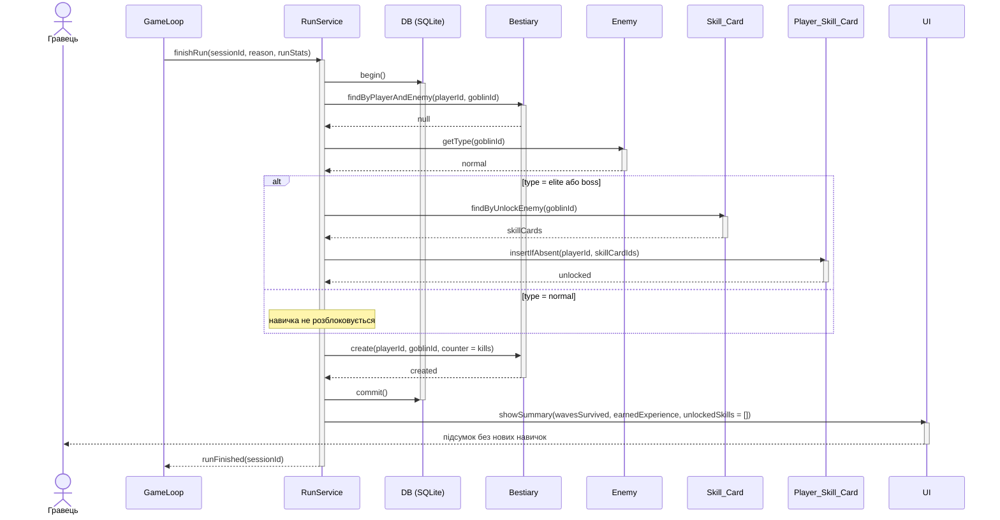

```mermaid
sequenceDiagram
    actor P as Гравець
    participant GL as GameLoop
    participant RS as RunService
    participant DB as DB (SQLite)
    participant B as Bestiary
    participant E as Enemy
    participant SC as Skill_Card
    participant PSC as Player_Skill_Card
    participant UI as UI
    GL->>RS: finishRun(sessionId, reason, runStats)
    activate RS
    RS->>DB: begin()
    activate DB
    RS->>B: findByPlayerAndEnemy(playerId, goblinId)
    activate B
    B-->>RS: null
    RS->>E: getType(goblinId)
    activate E
    E-->>RS: normal
    deactivate E
    alt type = elite або boss
        RS->>SC: findByUnlockEnemy(goblinId)
        activate SC
        SC-->>RS: skillCards
        deactivate SC
        RS->>PSC: insertIfAbsent(playerId, skillCardIds)
        activate PSC
        PSC-->>RS: unlocked
        deactivate PSC
    else type = normal
        Note over RS: навичка не розблоковується
    end
    RS->>B: create(playerId, goblinId, counter = kills)
    B-->>RS: created
    deactivate B
    RS->>DB: commit()
    deactivate DB
    RS->>UI: showSummary(wavesSurvived, earnedExperience, unlockedSkills = [])
    activate UI
    UI-->>P: підсумок без нових навичок
    deactivate UI
    RS-->>GL: runFinished(sessionId)
    deactivate RS
```
