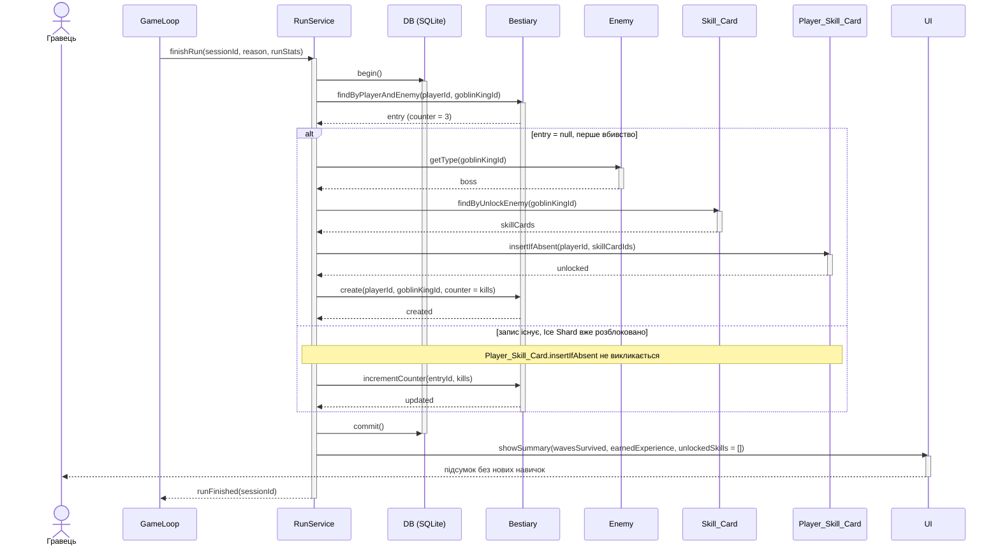

```mermaid
sequenceDiagram
    actor P as Гравець
    participant GL as GameLoop
    participant RS as RunService
    participant DB as DB (SQLite)
    participant B as Bestiary
    participant E as Enemy
    participant SC as Skill_Card
    participant PSC as Player_Skill_Card
    participant UI as UI
    GL->>RS: finishRun(sessionId, reason, runStats)
    activate RS
    RS->>DB: begin()
    activate DB
    RS->>B: findByPlayerAndEnemy(playerId, goblinKingId)
    activate B
    B-->>RS: entry (counter = 3)
    alt entry = null, перше вбивство
        RS->>E: getType(goblinKingId)
        activate E
        E-->>RS: boss
        deactivate E
        RS->>SC: findByUnlockEnemy(goblinKingId)
        activate SC
        SC-->>RS: skillCards
        deactivate SC
        RS->>PSC: insertIfAbsent(playerId, skillCardIds)
        activate PSC
        PSC-->>RS: unlocked
        deactivate PSC
        RS->>B: create(playerId, goblinKingId, counter = kills)
        B-->>RS: created
    else запис існує, Ice Shard вже розблоковано
        Note over RS,PSC: Player_Skill_Card.insertIfAbsent не викликається
        RS->>B: incrementCounter(entryId, kills)
        B-->>RS: updated
    end
    deactivate B
    RS->>DB: commit()
    deactivate DB
    RS->>UI: showSummary(wavesSurvived, earnedExperience, unlockedSkills = [])
    activate UI
    UI-->>P: підсумок без нових навичок
    deactivate UI
    RS-->>GL: runFinished(sessionId)
    deactivate RS
```
