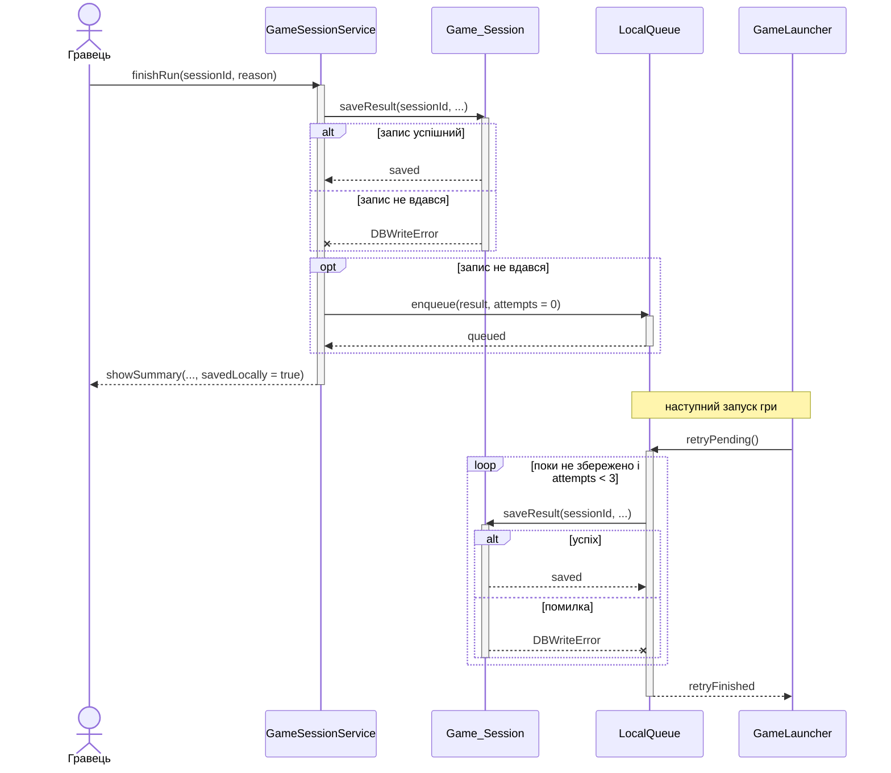

```mermaid
sequenceDiagram
    actor P as Гравець
    participant GS as GameSessionService
    participant S as Game_Session
    participant Q as LocalQueue
    participant L as GameLauncher
    P->>GS: finishRun(sessionId, reason)
    activate GS
    GS->>S: saveResult(sessionId, ...)
    activate S
    alt запис успішний
        S-->>GS: saved
    else запис не вдався
        S--xGS: DBWriteError
    end
    deactivate S
    opt запис не вдався
        GS->>Q: enqueue(result, attempts = 0)
        activate Q
        Q-->>GS: queued
        deactivate Q
    end
    GS-->>P: showSummary(..., savedLocally = true)
    deactivate GS
    Note over L,Q: наступний запуск гри
    L->>Q: retryPending()
    activate Q
    loop поки не збережено і attempts < 3
        Q->>S: saveResult(sessionId, ...)
        activate S
        alt успіх
            S-->>Q: saved
        else помилка
            S--xQ: DBWriteError
        end
        deactivate S
    end
    Q-->>L: retryFinished
    deactivate Q
```
