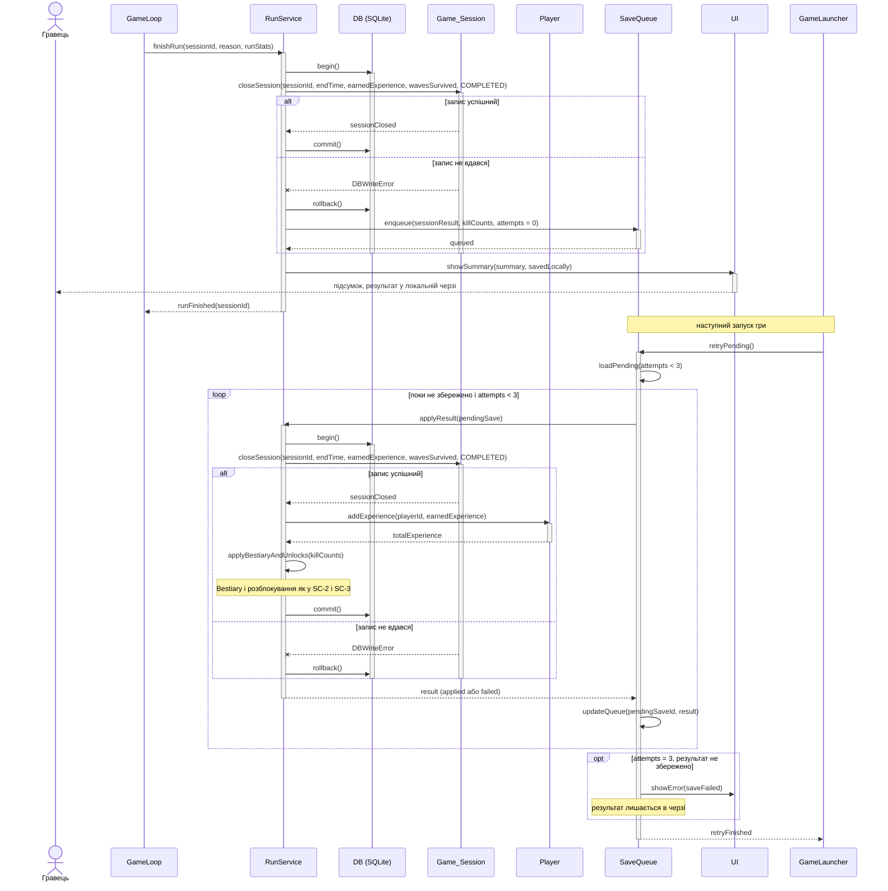

```mermaid
sequenceDiagram
    actor P as Гравець
    participant GL as GameLoop
    participant RS as RunService
    participant DB as DB (SQLite)
    participant S as Game_Session
    participant PL as Player
    participant SQ as SaveQueue
    participant UI as UI
    participant L as GameLauncher
    GL->>RS: finishRun(sessionId, reason, runStats)
    activate RS
    RS->>DB: begin()
    activate DB
    RS->>S: closeSession(sessionId, endTime, earnedExperience, wavesSurvived, COMPLETED)
    activate S
    alt запис успішний
        S-->>RS: sessionClosed
        RS->>DB: commit()
    else запис не вдався
        S--xRS: DBWriteError
        RS->>DB: rollback()
        RS->>SQ: enqueue(sessionResult, killCounts, attempts = 0)
        activate SQ
        SQ-->>RS: queued
        deactivate SQ
    end
    deactivate S
    deactivate DB
    RS->>UI: showSummary(summary, savedLocally)
    activate UI
    UI-->>P: підсумок, результат у локальній черзі
    deactivate UI
    RS-->>GL: runFinished(sessionId)
    deactivate RS
    Note over L,SQ: наступний запуск гри
    L->>SQ: retryPending()
    activate SQ
    SQ->>SQ: loadPending(attempts < 3)
    loop поки не збережено і attempts < 3
        SQ->>RS: applyResult(pendingSave)
        activate RS
        RS->>DB: begin()
        activate DB
        RS->>S: closeSession(sessionId, endTime, earnedExperience, wavesSurvived, COMPLETED)
        activate S
        alt запис успішний
            S-->>RS: sessionClosed
            RS->>PL: addExperience(playerId, earnedExperience)
            activate PL
            PL-->>RS: totalExperience
            deactivate PL
            RS->>RS: applyBestiaryAndUnlocks(killCounts)
            Note over RS: Bestiary і розблокування як у SC-2 і SC-3
            RS->>DB: commit()
        else запис не вдався
            S--xRS: DBWriteError
            RS->>DB: rollback()
        end
        deactivate S
        deactivate DB
        RS-->>SQ: result (applied або failed)
        deactivate RS
        SQ->>SQ: updateQueue(pendingSaveId, result)
    end
    opt attempts = 3, результат не збережено
        SQ->>UI: showError(saveFailed)
        Note over SQ: результат лишається в черзі
    end
    SQ-->>L: retryFinished
    deactivate SQ
```
