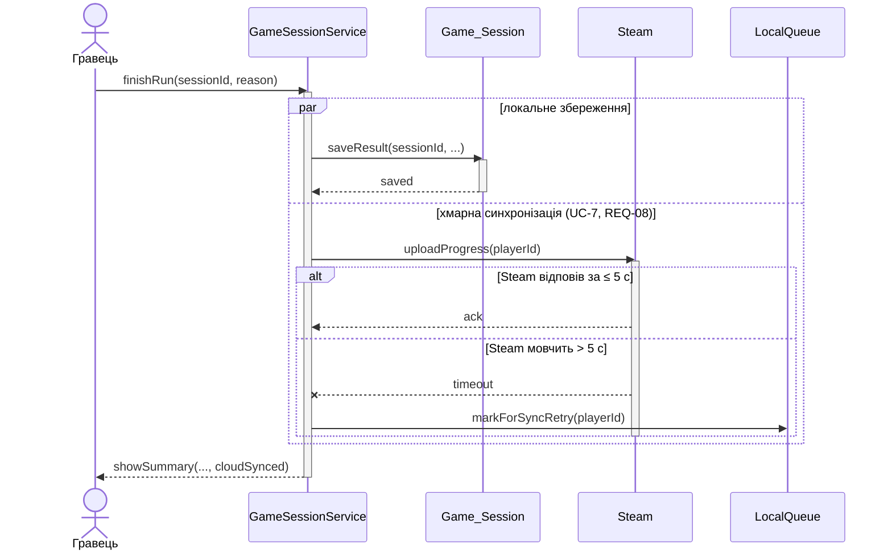

```mermaid 
sequenceDiagram
    actor P as Гравець
    participant GS as GameSessionService
    participant S as Game_Session
    participant ST as Steam
    participant Q as LocalQueue
    P->>GS: finishRun(sessionId, reason)
    activate GS
    par локальне збереження
        GS->>S: saveResult(sessionId, ...)
        activate S
        S-->>GS: saved
        deactivate S
    and хмарна синхронізація (UC-7, REQ-08)
        GS->>ST: uploadProgress(playerId)
        activate ST
        alt Steam відповів за ≤ 5 с
            ST-->>GS: ack
        else Steam мовчить > 5 с
            ST--xGS: timeout
            GS->>Q: markForSyncRetry(playerId)
        end
        deactivate ST
    end
    GS-->>P: showSummary(..., cloudSynced)
    deactivate GS
```
