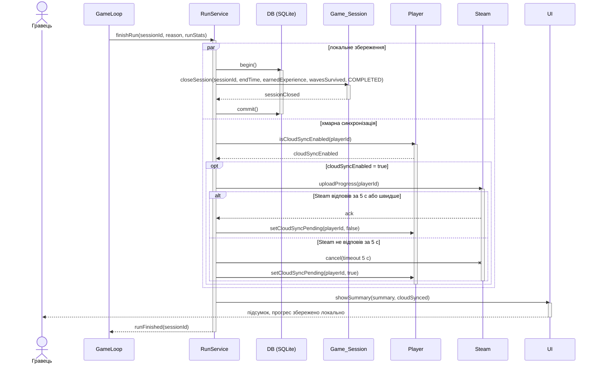

```mermaid
sequenceDiagram
    actor P as Гравець
    participant GL as GameLoop
    participant RS as RunService
    participant DB as DB (SQLite)
    participant S as Game_Session
    participant PL as Player
    participant ST as Steam
    participant UI as UI
    GL->>RS: finishRun(sessionId, reason, runStats)
    activate RS
    par локальне збереження
        RS->>DB: begin()
        activate DB
        RS->>S: closeSession(sessionId, endTime, earnedExperience, wavesSurvived, COMPLETED)
        activate S
        S-->>RS: sessionClosed
        deactivate S
        RS->>DB: commit()
        deactivate DB
    and хмарна синхронізація
        RS->>PL: isCloudSyncEnabled(playerId)
        activate PL
        PL-->>RS: cloudSyncEnabled
        opt cloudSyncEnabled = true
            RS->>ST: uploadProgress(playerId)
            activate ST
            alt Steam відповів за 5 с або швидше
                ST-->>RS: ack
                RS->>PL: setCloudSyncPending(playerId, false)
            else Steam не відповів за 5 с
                RS-xST: cancel(timeout 5 с)
                RS->>PL: setCloudSyncPending(playerId, true)
            end
            deactivate ST
        end
        deactivate PL
    end
    RS->>UI: showSummary(summary, cloudSynced)
    activate UI
    UI-->>P: підсумок, прогрес збережено локально
    deactivate UI
    RS-->>GL: runFinished(sessionId)
    deactivate RS
```
